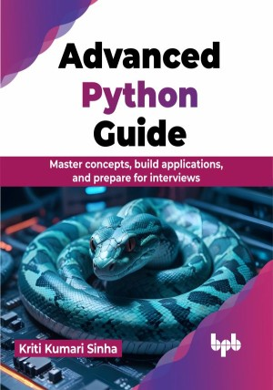

# Advanced Python Guide

Unlock your coding potential with Python!

This is the repository for [Advanced Python Guide
](https://bpbonline.com/products/advanced-python-guide),published by BPB Publications.

## About the Book
This book introduces Python, a flexible programming language. Master the fundamentals, then leverage Python's capabilities to solve problems, automate tasks, and bring your ideas to life. In today's tech-driven world, Python transforms you into a creator, not just a consumer.
 
This comprehensive guide equips you with the fundamentals of Python programming, from installing it and setting up your environment to mastering core concepts like variables, data structures, functions, and object-oriented programming (OOP). Explore Python's standard library modules for common tasks like file handling and delve into writing clean Pythonic code using advanced techniques like list comprehensions. This book also covers optional advanced topics like concurrency, networking, and data science applications. Further, you will be able to ensure code quality with testing and debugging techniques mentioned in the book, and learn the best practices for a professional setup (PEP 8). 

Finally, apply your Python skills by building real-world projects, and prepare for Python developer interviews with confidence. With its clear explanations, technical accuracy, and focus on best practices, this book is your one-stop shop for mastering Python and unlocking its vast potential.

## What You Will Learn
• Master Python basics by understanding variables, data types, and operators.

• Enhance your problem-solving abilities by employing loops, conditionals, and algorithms.

• Hands-on coding experiences, constructing practical projects such as calculators and games.

• Data exploration by analyzing data sets, visualizing trends, and making informed decisions.

• Join the Python community to collaborate, share, and contribute to open-source projects.
